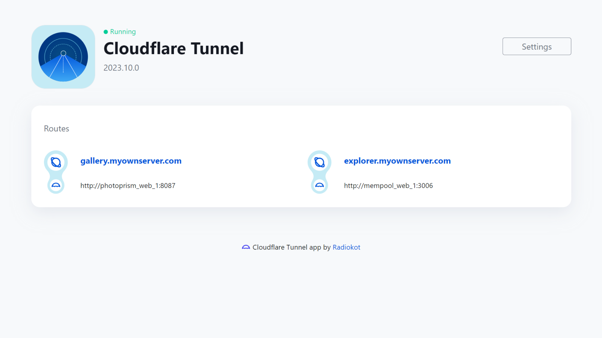

# Umbrel Cloudflare Tunnel client
Access your [Umbrel](https://umbrel.com/) apps from the Internet using Cloudflare network. Learn more about tunnels on [Cloudflare website](https://www.cloudflare.com/products/tunnel/).

Get it from:
- Umbrel app store – comming soon
- [Radiokot's Umbrel apps](https://github.com/Radiokot/umbrel-app-store)

## How to use it

To use this app, you must have a set up Cloudflare account with added domains. Check out [the guide with examples](https://github.com/Radiokot/umbrel-cloudflared/wiki/How-to-set-up-Cloudflare-Tunnel-on-your-Umbrel) to configure your own tunnel.

## Sponsorship
I am very grateful to everyone [supporting this project](https://radiokot.com.ua/tip) ♥ To join the public sponsors list, email me the transaction reference once it is complete.

## Environment variables
|Name|Meaning|
|-|-|
|`CLOUDFLARED_HOSTNAME`|Hostname or IP of the `cloudflared` container|
|`CLOUDFLARED_METRICS_PORT`|`cloudflared` metrics server port on the corresponding container|
|`CLOUDFLARED_TOKEN_FILE`|Path to a file to store the connector token|
